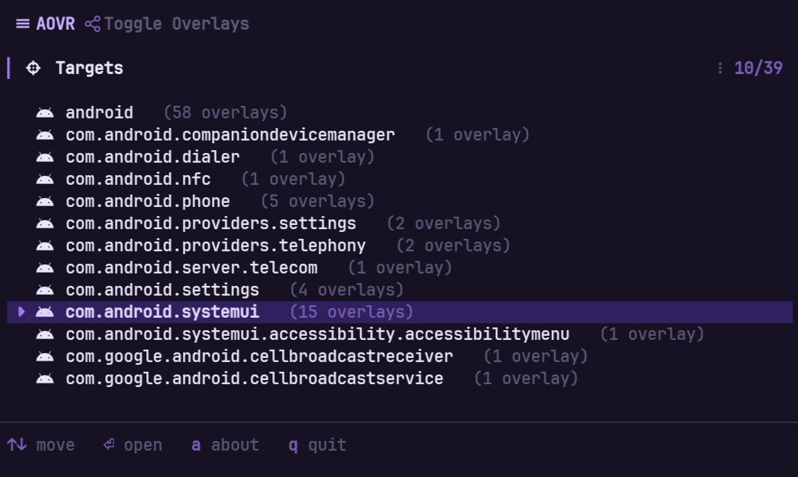

# AOVR

<div align="center">



**Terminal User Interface (TUI) for interactively managing Android Runtime Overlays.**

[](https://www.rust-lang.org/)
[](https://github.com/ratatui/ratatui)
[](./LICENSE)

</div>

## Overview

**AOVR** brings an intuitive keyboard-driven terminal interface to Android's native cmd overlay system. Instead of manually parsing messy text streams from `cmd overlay list` and copying package names to run enable/disable commands, **AOVR** categorizes, groups, and lets you toggle runtime overlays seamlessly.

## Features

- **Electric Violet Palette:** Modern, borderless dark-mode panel layout powered by Ratatui.
- **Grouped Target View:** View all Android target packages alongside active overlay badge counts.
- **Interactive Toggle:** Enable or disable overlays instantly using `Space` and apply changes with `Enter`.
- **Vim & Arrow Navigation:** Native support for both `j`/`k` and `↑`/`↓` directional inputs.

## How It Works

Under the hood, **AOVR** wraps Android's native Overlay Manager Service (OMS) commands via `su -c`:

- **Listing Overlays:** Executes `su -c cmd overlay list` to parse targets, active states, and broken overlays.
- **Enabling Overlays:** Invokes `su -c cmd overlay enable <package>`.
- **Disabling Overlays:** Invokes `su -c cmd overlay disable <package>`.

It runs directly inside an Android terminal environment such as **Termux** with root access.

## Keyboard Reference

| Key | Action |
| :--- | :--- |
| `↑` / `↓` or `j` / `k` | Navigate items in the list |
| `Space` | Toggle selected overlay state (*Enabled* / *Disabled*) |
| `Enter` | Open target detail / Apply changes and go back |
| `Esc` | Go back to previous screen |
| `a` | Open **About** / Keyboard Reference screen |
| `q` | Exit AOVR |

## Installation
### One-Line Quick Install (Termux / Android)

Run the following command in Termux or an ADB shell:

```bash
curl -fsSL https://raw.githubusercontent.com/sohan-f/aovr/master/install.sh | sh
```
## Building
### Prerequisites

1. **Rust Toolchain**: Ensure Cargo and Rust are installed (`rustc >= 1.74`).
2. **Android Environment**:
    - **Termux** installed on a rooted Android device.
    - Root access available via `su` (e.g. Magisk).

### Building from Source

```bash
# Clone the repository
git clone https://github.com/sohan-f/aovr.git
cd aovr

# Build release binary
cargo build --release

# The compiled binary will be available at target/release/aovr
```

## Usage
### If installed via installation script
```bash
aovr
```

### Running inside Termux (On-Device)

```bash
# Move binary to path and run
cp target/release/aovr $PREFIX/bin/aovr
aovr
```

Root access is handled automatically; AOVR invokes `su -c` internally when executing overlay commands.

## Design Palette

AOVR uses a custom **Electric Violet** color system:

| Token | Preview | Purpose |
| :--- | :--- | :--- |
| `ACCENT` |  | Primary highlights & cursor focus bar |
| `PANEL_BG` |  | Deep solid panel background |
| `SEL_BG` |  | Active row selection fill |
| `C_OK` |  | Enabled status indicator |
| `C_WARN` |  | Disabled status / Warning |
| `C_ERR` |  | Broken / Invalid overlay package |

## License

This project is licensed under the [MIT License](LICENSE).
